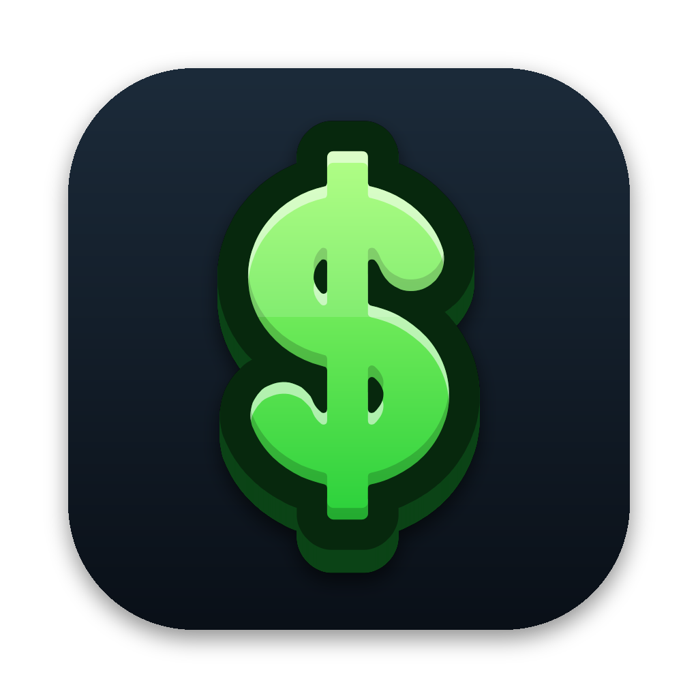
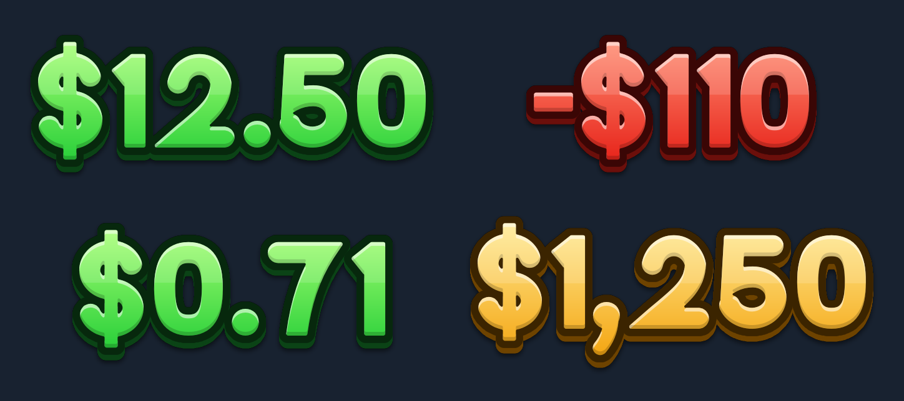

<p align="center"></p>

<h1 align="center">PriceTag</h1>

<p align="center">Type a price and get a transparent PNG of it, ready to drop into your trading card videos.</p>

<p align="center"></p>

## What it does

- **Type a price, get a tag.** `12.5` becomes `$12.50`, `-110` becomes `-$110`, `.71` becomes `$0.71`, `1234` becomes `$1,234`.
- **Green or red.** Press ⌘R to switch. Negative prices turn red automatically (you can turn this off). Gold and white are there too.
- **Its own font.** Mint Display is a heavy, rounded font made for this app. It's built into the app, so you don't install anything.
- **Looks good on video.** Dark outline, 3D depth, drop shadow and shine, all adjustable.
- **Gets into your editor fast.**
  - **Drag** the preview straight into Final Cut, Premiere, DaVinci Resolve, CapCut or Finder.
  - **Return** copies the PNG to the clipboard.
  - **⌘Return** saves it to your export folder (`~/Desktop/PriceTag` by default).
  - **⌘B** opens Batch Export: paste a whole list of prices, one per line, and get one PNG for each.
- **Sharp at any resolution.** Export at 150, 250, 400 or 700 px tall. 250 suits 1080p, 400 or more suits 4K.

Files are named after the price, like `$12.50 green.png`. Dragged files are saved to your export folder rather than a temp folder, so editors that link to media (like Premiere) don't lose them later.

## Keyboard shortcuts

| Shortcut | Action |
| --- | --- |
| Return | Copy the PNG |
| ⌘Return | Save to the export folder |
| ⌘S | Save As… |
| ⌘B | Batch export |
| ⌘R | Switch green / red |
| ⌘1 – ⌘4 | Green, Red, Gold, White |
| ⇧⌘C | Copy the PNG (from anywhere) |

## Install

Requires macOS 13 Ventura or later.

**Download:** open the latest run under [Actions → build](../../actions/workflows/build.yml) and download the `PriceTag` artifact. Unzip it and drag `PriceTag.app` into Applications. The app isn't notarized yet, so the first time you open it, right-click it and choose **Open**.

**Build it yourself** (needs Xcode or the Command Line Tools):

```sh
git clone https://github.com/macprotips/PriceTag.git
cd PriceTag
scripts/build-app.sh          # creates build/PriceTag.app
open build/PriceTag.app
```

You can also open `Package.swift` in Xcode and press Run, or use `swift run`.

## Project layout

| Path | What's there |
| --- | --- |
| `Sources/PriceTag` | The SwiftUI app (window, controls, export, batch) |
| `Sources/PriceTagKit` | Price formatting, the embedded font and the renderer |
| `Tests/PriceTagKitTests` | Formatter and renderer tests (`swift test`) |
| `Font/MintDisplay.otf` | The font file, if you want to install it for other apps |
| `Tools/build_font.py` | Builds the font from code. Edit the glyphs here |
| `Tools/render_preview.py` | Renders `docs/samples.png` and the app icon |
| `scripts/build-app.sh` | Builds and signs `PriceTag.app` |

### Changing the font

Every glyph in Mint Display is a skeleton line drawn in `Tools/build_font.py`. The script strokes it heavy, merges the pieces and rounds the corners. To change a glyph, edit the script and run:

```sh
pip install fonttools skia-pathops pillow numpy scipy
python3 Tools/build_font.py      # updates Font/ and the copy embedded in the app
python3 Tools/render_preview.py  # updates the README samples and app icon
```

### Signing for distribution

`scripts/build-app.sh` signs the app ad hoc by default. To sign it with your Developer ID, set `SIGN_IDENTITY="Developer ID Application: …"`. Set `UNIVERSAL=1` to build for both Apple Silicon and Intel.
